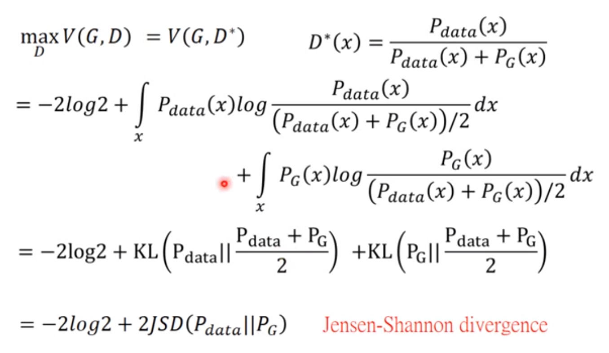

# GAN的基础理论

*李宏毅老师课程笔记*

[toc]

图像有固定自己的分布,只有在固定的地方才能生成特定的图片.而生成图片就需要机器找到上述的分布.

## 机器学习之前使用的方法用的是最大似然估计:

所谓的最大似然估计,等同于最小化KL Divergence

## 机器学习方法:Generator

生成器就是一个用来估计概率P~G~的网络.

 

输入用哪种分布影响可能不会太大.

是P~G~接近P~Data~,但是如何计算divergence?我们没办法得到具体的分布公式.

Discrimintor:

使用生成的样本近似分布,从而比较.

通过判决器可以实现上图中的目的:

上述红框中的东西就可以看作divergence

数学讲解:

x可以是任何的值,可以把各个不同的x分看算,可以把某一个x拿出来,然后找到D让目标公式越大越好.

将D* 带入V中

为了凑出目标形式,然后除以2,再将2提出来

当我们在训练判决器的时候,就是为了衡量P~data~和P~G~之间的divergence

假设世上只有三种分布,则目标就是红点所示的地方,最终的G*最优解是G3所示的红点.

 

JS divergence是V曲线上最大的值.

建议:G不能更新太多,D要更新很多次.

实际计算:

 实际中无法获得正式表达式,从而使用样本进行训练:

## GAN算法总览:

实际训练中的目标函数:

两个公式趋势一样,但是微分不一样.但是实际中两种公式效果差不多.

## 直观理解

 

