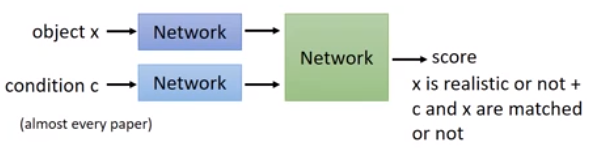
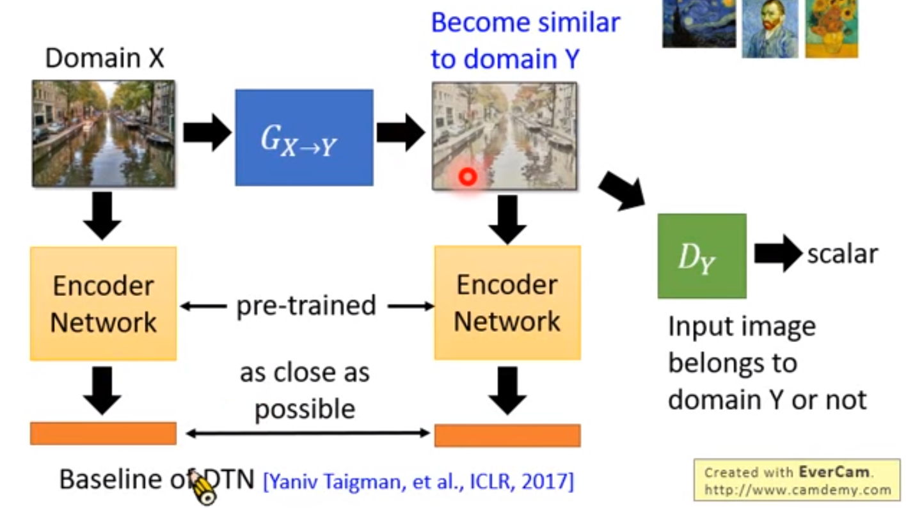
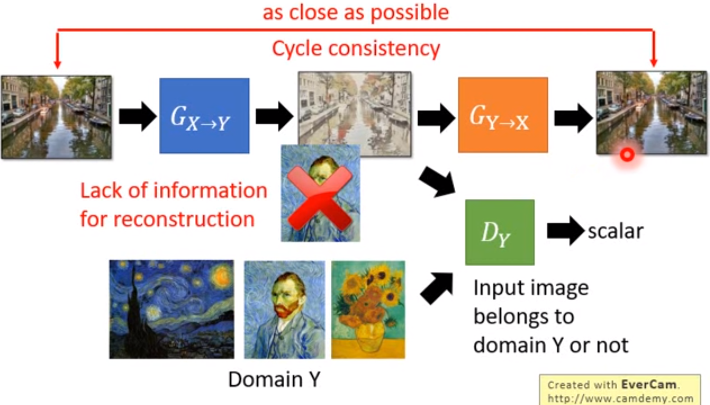
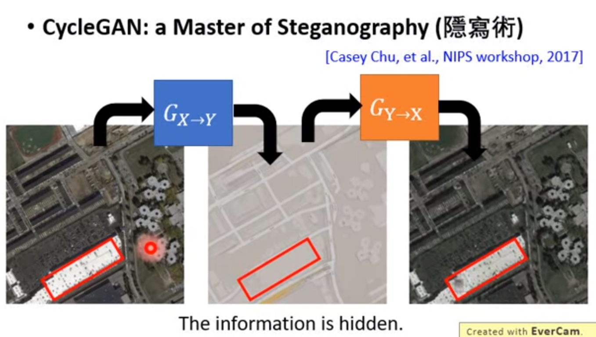
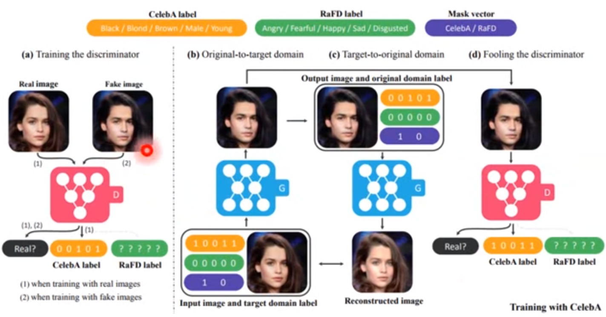
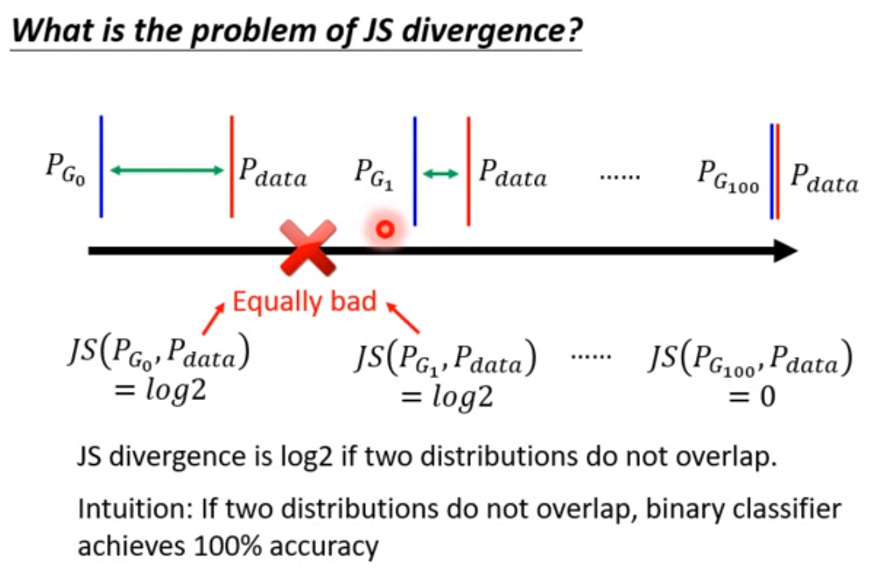
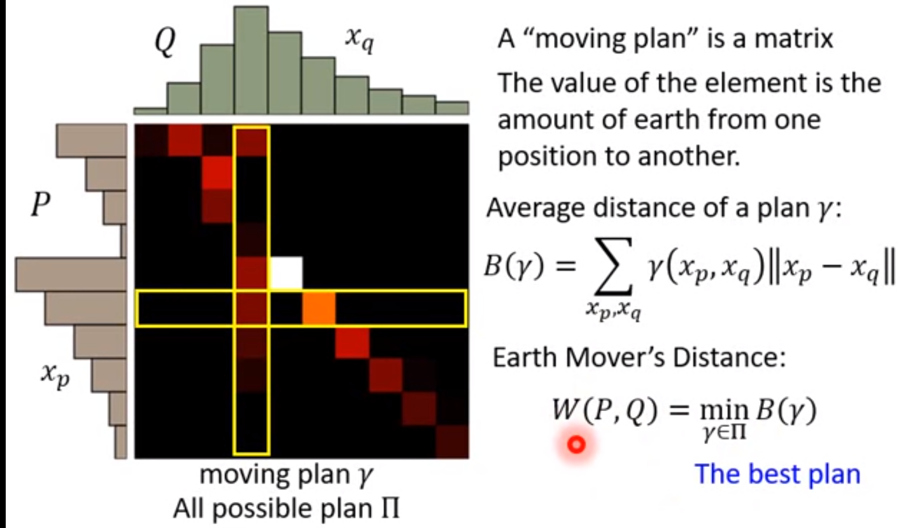
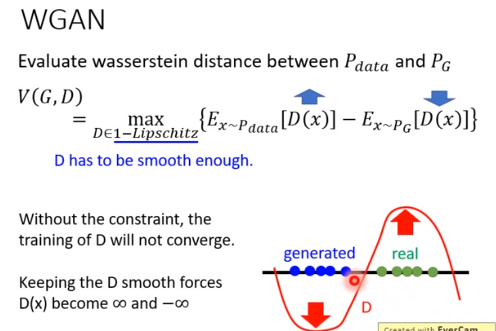
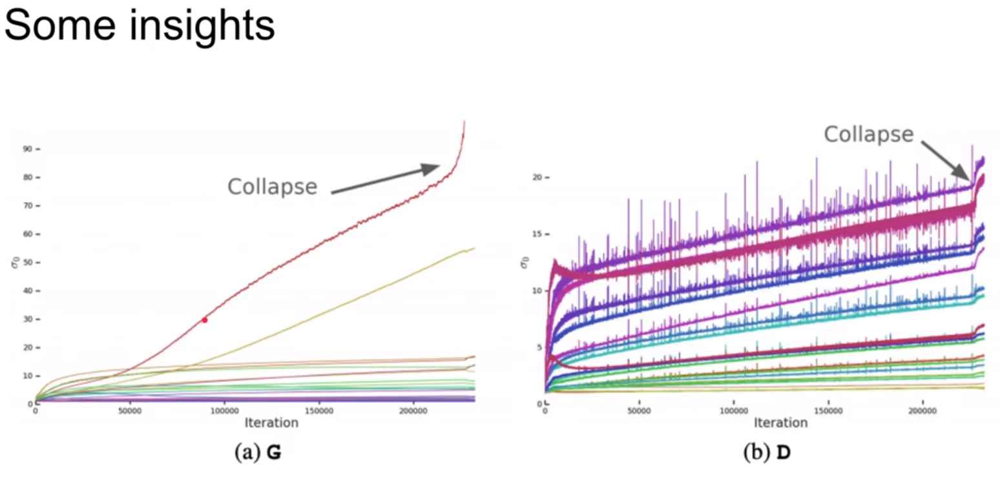
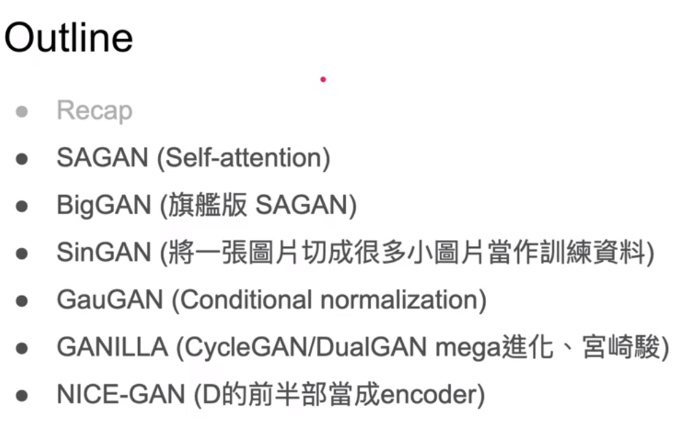

# GAN网络的变体

*李宏毅教授机器学习课程笔记*

[toc]

## Conditional GAN

### 生成器模型：c为对于图片的描述

### 判决器模型：x为判决器产生的图片，c为对于图片的描述。

​	判决器产生一个scalar，需要判断x是否为真，以及是否与c符合。

判决器评分标准

### 训练过程：

### 常见的CGAN网络:

#### 判决器

1. 

2. 

   把1中的拆开，从而告诉网络什么样的是高分，什么样的是低分。从而知道给低分的原因是什么，让网络可以单独学习。

#### [Stack GAN][https://arxiv.org/pdf/1612.03242v1.pdf]

先产生小张的图，再产生大张的图。

### image to image

supervised方法回导致产生的图片比较模糊。因为网络产生的是许多符合条件的图片平均的结果。

为了解决上述方法，引入GAN：

#### [Patch GAN][https://arxiv.org/pdf/1611.07004.pdf]

如果用整张图片作为评价标准,则结果大概率不好,因而让判决器每次只检查一小块图.

patch的大小可以自己调整.

### CGAN的其他应用

* Speech Enhancement

* Video Generator

  

## Unsupervised Conditional Generation

### 实现方法

#### 1. Direct Transformation

输入和输出图片之间变换不大,类似于风格变换和图像颜色变化.

* 实现细节:

判决器应该见过很多Domain Y的图像,从而可以判断输入图像是否属于Domain Y.

 

* 存在问题:

生成器的结果虽然是Domain Y中的画,但是和输入不匹配,从而引起判决器的误判.

* 解决方法:

1. 直接无视上述问题,因为本身差距不会太大.

2. 生成器加入新的损失

   

3. Cycle GAN

   

   双向的Cycle GAN 

   

   **存在的问题:**

   Cycle Gan可能回隐藏一些信息.

   

   Dual GAN, Disco GAN和Cycle GAN原理基本相同.

   ### Star Gan

   用一个生成器生成多个domain

   

   

   

   有多个Domain,每个Domain都用编码表示.判决器不仅要判断输入图片是否是真实的,而且还要判断输入图片属于哪个Domain.

   

#### 2. Projection to Common Space

适合于差距很大的输入输出.

目标:

先抽出X和Y的特征,然后输入不同的解码,从而得到对应的图像.

无监督的训练方法:

上述可以看作就是要给VAE-GAN.

存在问题:上述两个图片之间没有联系,从而导致生成的图片可能无联系.

解决方法:

1. 公用参数

   

2. 再加入一个判决器

   

3. Cycle Consistency

   
   
   于Cycle GAN思想类似.
   
   用于CombGAN
   
4. Semantic Consistency

   

## fGAN(用的概率不大)

fGAN告诉我们任何divergence都可以放到GAN的架构里面去.

 

 

带入不同的f(x)就可以得到不同的divergence

上图是利用枚举的方法找到最大值.

上图是用画图的方式找到最大值.

判决器D利用枚举的方法解上面的式子.

  

### 训练GAN的时候回遇到问题:

* Mode Collapse:生成的图片相似性越来越高
* Mode Dropping: 生成器每次产生的多样性不行.

fGAN可能回解决上述问题.

P~G~和P~data~ 是不重叠的.即使有重叠,重叠也非常少,也可以看作无重叠.

  

JS divergence的问题:只要不重叠,其值都为log(2),从而无法更新.

## LSGAN

目标是让蓝色的点跟随红线梯度向绿色点靠近,但是实际情况下可能遇到红线梯度为0,蓝色的点无法更新.因而LSGAN将原本的sigmoid函数替换成线性函数.

## WGAN

换了衡量P~G~和P~data~的标准,换成Earth Mover's Distance.

类比于把P的土移到Q的地方,推土机所走的距离,如上图最简单的情况,就离为d.下面考虑更复杂的情况:

同样的分布,不同的方法,推土机走的距离不一样.穷举所有的铲土方法,推土机走的距离最小的距离就是所需要的值.

#### 损失的正式的定义:

x~p~和x~q~ 为坐标轴,每列或者每行的值累加,就为所对应的轴上的bar的值.

在原有损失不能更新的情况,使用新的损失就可以更新:

更新后的损失:

不能只考虑P~G~和P~data~的值,而且要保证D是1-lipschitz函数,即D要足够顺滑.

所以如何给D加入限制?

* 原始WGAN

  

  上述方法其实不能完全达到所需要的效果.其中w为距离.

* WGAN-GP

  

  无法遍历所有的x,从而替换为只考虑P~penalty~ 中生成出来的.

  

  理论上小于1不需要惩罚,但是实际对其进行了操作.

  

  利用Spectrum Norm技术可以实现下面这个约束:

  

  

  

  ### 从GAN改为WGAN:

  

  ## EBGAN

   把判决器改为AutoEncoder架构:

  reconstruction error就为判决器损失函数,判决器可以pre train,可以先pre train,从而判决器一开始就很强,然后就可以得到很好的生成器.

  

实际中,设置一个阈值,只要生成器损失小于某个范围就好.这个阈值是自己修改的.

 

## LSGAN

加了一个margin,需要先有一个方法, 

## 用GAN进行特征提取

### InfoGAN

在训练时,我们希望改变input,output会有对应的变化,但是实际不是这样的.

如上图所示,我们期望的分布是规则的,但是实际的分布很复杂,没办法按照理想的情况模拟.

InfoGAN就是为了解决上述问题:

判决器和分类器可以共享参数.

让生成器学习到C的每一个维度对输出X都有影响,那么可以正确分类,否则不行.z'为纯粹随机的东西.

### VAE-GAN

用GAN强化VAE或者用VAE强化GAN.

算法实现:

### BiGAN

算法实现:

目的:

让上图中的P和Q的分布越来越近,

理想情况下BiGAN和下图中的双向Autoenconde,但是在实际情况下不一样.

### Triple GAN

适用于只有少量标签的情况,目标是学习一个分类器,可以从有标签的数据训练分类器.是个半监督学习的问题.

训练数据和测试数据不匹配,在不同维度,解决方法:Domain-adversarial training

Feature Disentangle:

### 例子

寻找vector和label之间的关系,通过逆向工程实现,其中生成器固定不更新.可以用判决器参数初始化编码器.

把对应特征的code提取出来,然后把code平均,对应特征相减,就能得到对应特征的结果.例如:分别对长发和短发图片提取code,然后将两个code的平均值相减,就能得到长发对应的code向量,然后给短发code加上这个向量,输入生成器,就能得到长发图片.

## SAGAN(self attention GAN)

判决器和生成器用不同的学习率:

其实D和G的学习利比值应该是2:1比较好.

## BIgGAN

在SAGAN的基础上做的.

通过上图的方式可以让模型专注于产生某部分的图片.

越大的model,训练越快,但坏的也越快.

## SinGAN

只需要一张图片就行,把一张图片切成很多张,从而训练网络.单一size切割达不到要求,因而切不同的size.

后面的黄色表示kernel大小不变,

应用:

* 超分
* paint to image
* 修图
* 风格迁移

## GauGAN

开始定义不同颜色代表的目标,

* SPADE

Normalization参数值固定,与输入无关.

可学习的Normalization,和输入图像有关系.

* Use encoder(Style)

通过Encoder输入要产生的图片的风格,从而抽取其特征,与输入结合,从而引导生成器.

## GANILLA

 

现有的网络没有平衡生成图片的内容和风格.

## NICE-GAN

* No Independence encoder

作者认为判决器本身就具有编码和分类功能.

在训练一个的时候固定另一个.

* Moder structure

## GAN网的历史

