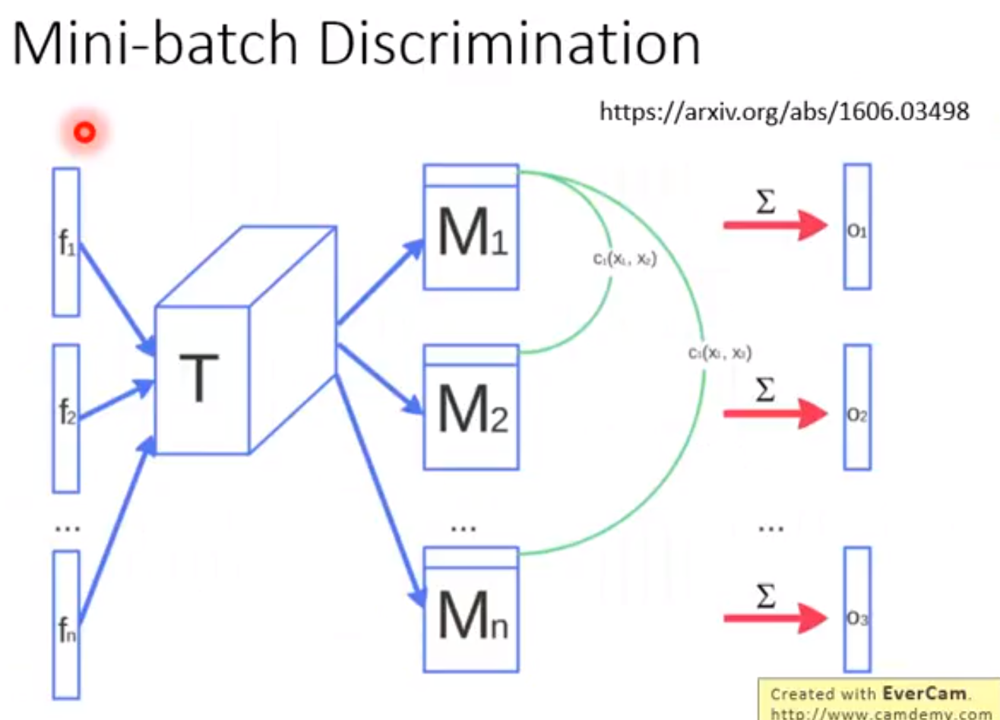

# Evaluation

*李宏毅老师的笔记总结*

客观的方法来评价产生的结果

Likelihood:

用已有的分布生成样本,然后用样本评价指标.

常见的方法是拿一个已经训练好的分类器来判断结果的好坏:

常用的Score:

好的生成器产生的图片不只单幅图片质量高,而且生成类别也达到要求.

我们也希望生成器有创造力,要能生成原始数据集没有的东西:

让判决器一次看一组图,然后抓取组图的特征:

