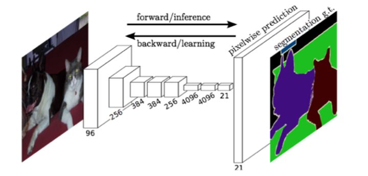
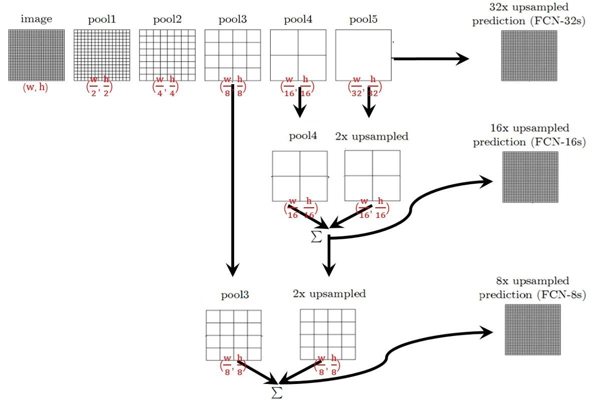
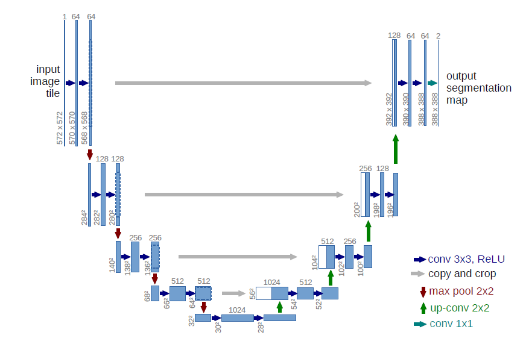

# 神经网络架构总结

*蔡坤伦 				2020.8.4*

*本文旨在总结现有常用神经网络架构*

[toc]

## 图像分割

### 1. FCN

[参考文献1] https://zhuanlan.zhihu.com/p/30195134 

[参考文献2] https://zhuanlan.zhihu.com/p/31428783

FCN对图像进行像素级的分类，从而解决了语义级别的图像分割（semantic segmentation）问题。与经典的CNN在卷积层之后使用全连接层得到固定长度的特征向量进行分类（全联接层＋softmax输出）不同，FCN可以接受任意尺寸的输入图像，采用反卷积层对最后一个卷积层的feature map进行上采样, 使它恢复到输入图像相同的尺寸，从而可以对每个像素都产生了一个预测, 同时保留了原始输入图像中的空间信息, 最后在上采样的特征图上进行逐像素分类。最后逐个像素计算softmax分类的损失, 相当于每一个像素对应一个训练样本。下图是Longjon用于语义分割所采用的全卷积网络(FCN)的结构示意图：

整个FCN网络的基本原理如下图：

先通过卷积层和池化层将图像尺寸变为原来的1/32，然后分别通过三种方法将其恢复成原始的尺寸。

* FCN-32S：直接对Pool5的结果进行32倍上采，然后对上采后的结果每个点做softmax，获得最终的结果。
* FCN-16s：先对Pool5的结果做2倍上采，再将上采样的结果与pool4的结果按像素相加，然后对相加后的结果进行16倍上采样，并对上采样的结果进行softmax。
* FCN-8s：将FCN-16s中16倍上采样之前的结果和Pool3的结果按像素相加，然后进行8倍上采样，再将结果进行softmax，最后得到最终结果。

恢复后的图像质量：FCN-32s < FCN-16s < FCN-8s

### 2. U-Net

[参考文献] https://zhuanlan.zhihu.com/p/46251798

上图中，每个蓝色块代表一个特征块，上面的数字代表了通道数，下面的数字代表其尺寸大小。白色和蓝色混合块是将前一个网络的结果和上采样得到的结果按照通道进行拼接得到的结果。